# [Learning Management System]()

**_Learning Management System_** is a dynamic web application designed for seamless online education. 🌐 Users can _effortlessly explore and filter courses_ of interest, ensuring a user-friendly experience. **Secure course transactions** are enabled through the integration of **Stripe**, adding a layer of trust for users. 🛒 Additionally, the system features innovative **chapter progress tracking**, offering dynamic calculations for insightful learning journeys. 📈 **Personalized student dashboards** and a dedicated **teacher mode** enhance the overall educational experience, fostering a collaborative and engaging environment. 🎓 Instructors can _effortlessly create and publish courses_ using a rich text editor, while the system's intuitive design allows for **easy chapter reordering**.

**Multimedia management** is simplified with **UploadThing**, and **video processing and delivery** are optimized through **Mux**, ensuring a high-quality visual experience. 🎥 **Secure access** is guaranteed with **Clerk authentication**, and efficient **database interaction** is achieved through **Prisma**, utilizing a robust **MySQL database** powered by **Planetscale**. 🚀 **Explore and contribute** to elevate the world of online learning!

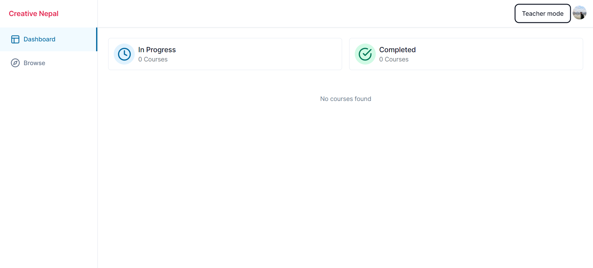
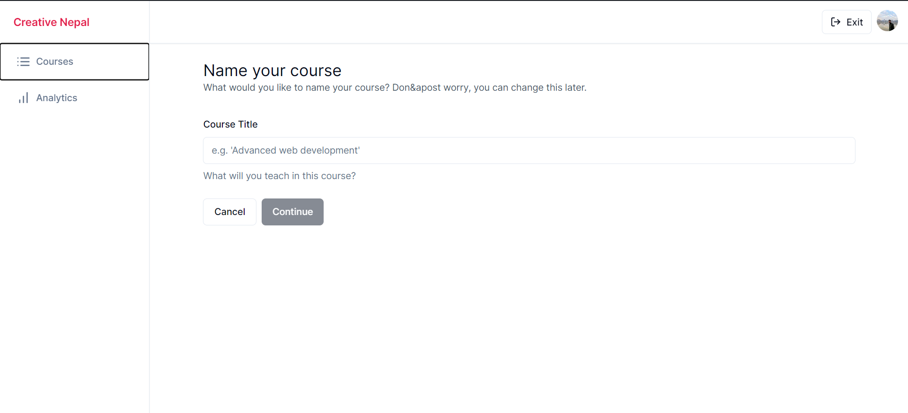
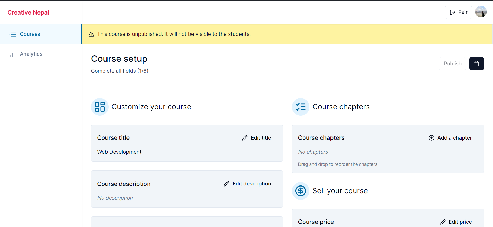
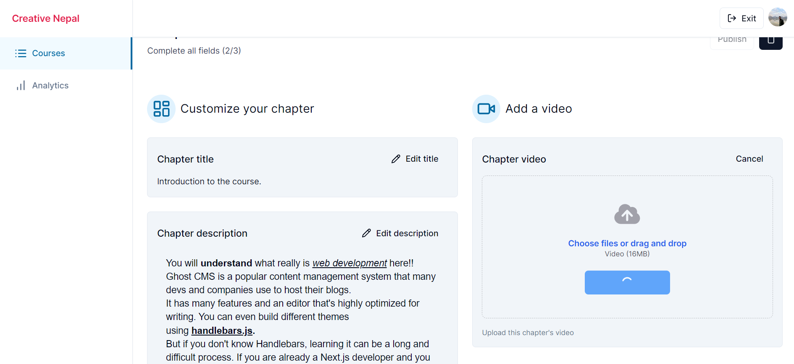
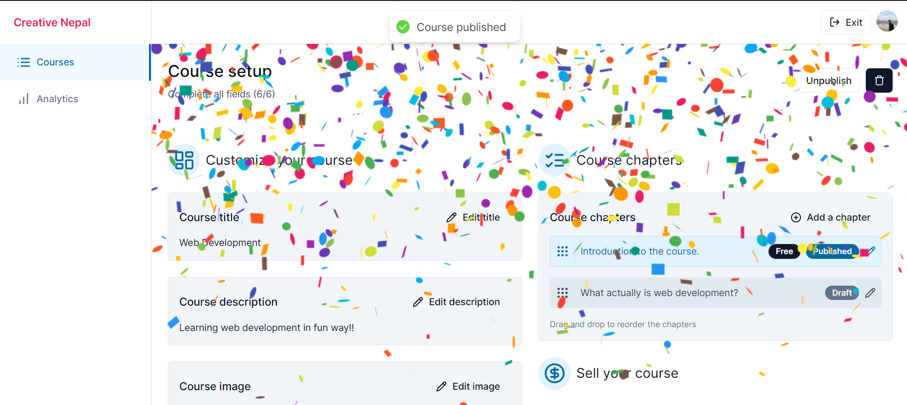
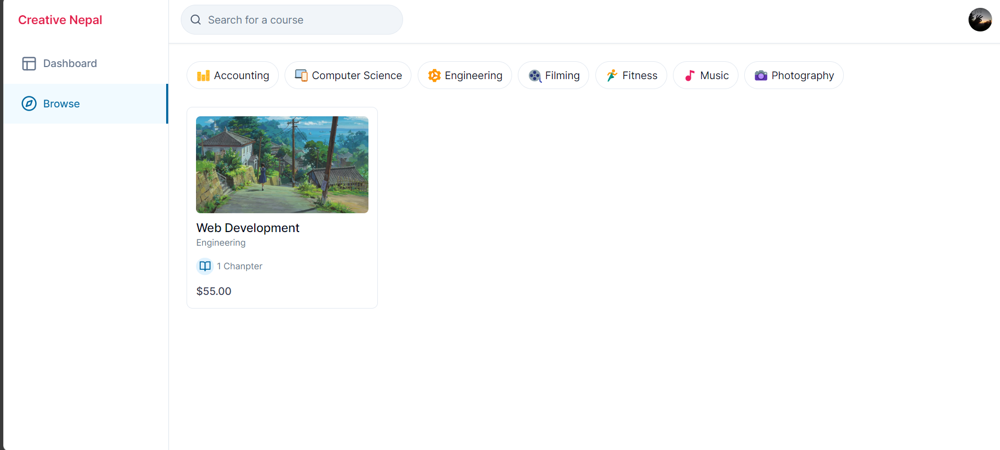
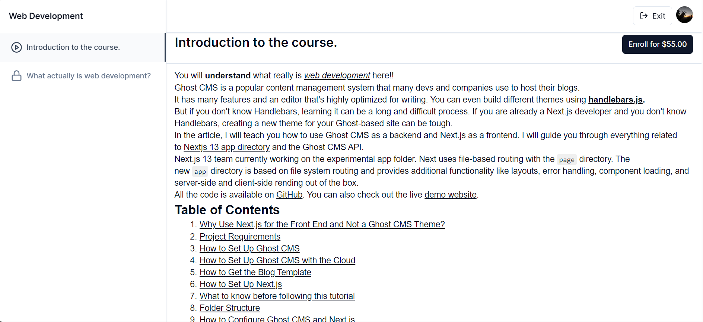
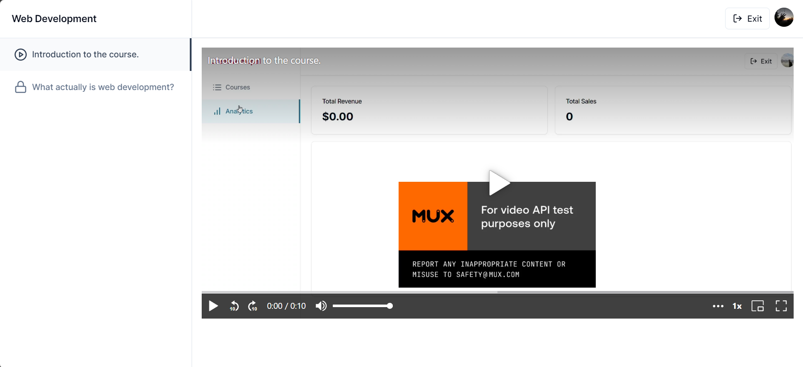
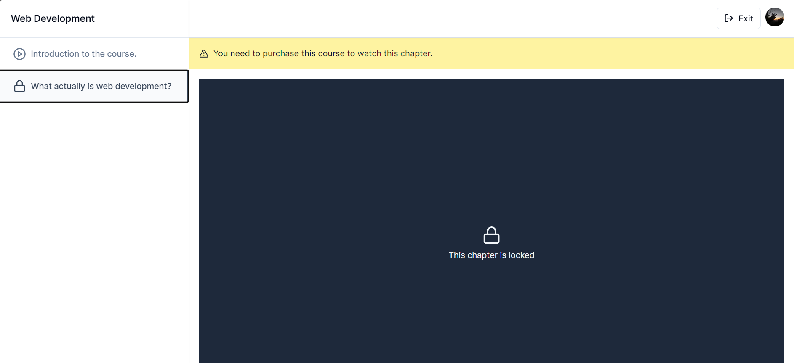
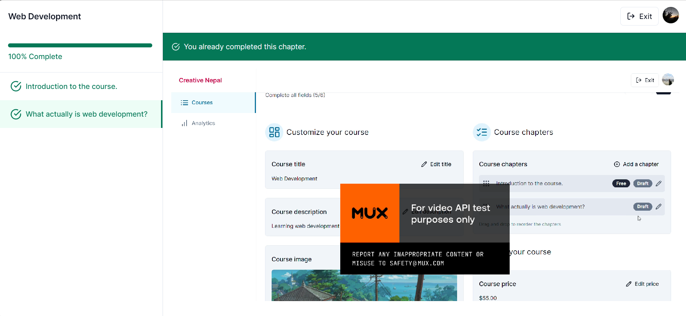
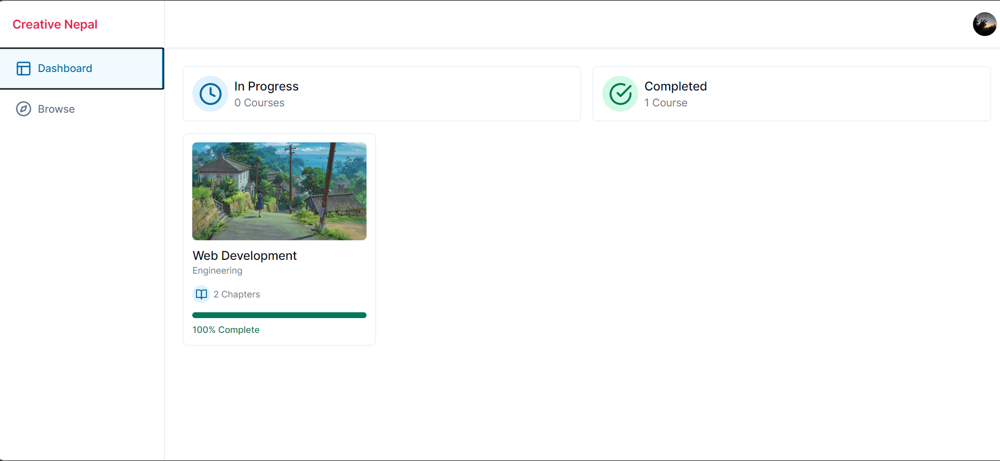
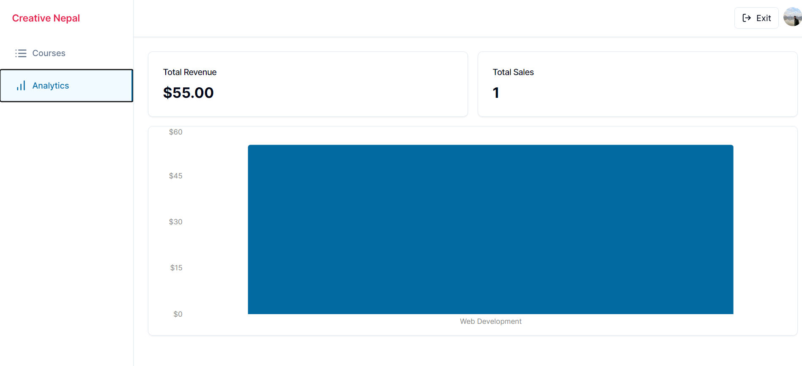

```sh
npx shadcn-ui@latest add input
npx prima migrate reset
npx prima db push
```

```js
const requiredFields = [
  course.title,
  course.description,
  course.imageUrl,
  course.price,
  course.categoryId,
  course.chapters.some((chapter) => chapter.isPublished),
];

const totalFields = requiredFields.length;
const completedFields = requiredFields.filter(Boolean).length;

const completed = `(${completedFields}/${totalFields})`;
const isComplete = requiredFields.every(Boolean);
```

```jsx
const [isEditing, setIsEditing] = useState(false);
const toggleEdit = () => setIsEditing((current) => !current);
const router = useRouter();

const formSchema = z.object({
  title: z.string().min(1, {
    message: "Title is required",
  }),
});

type Values = z.infer<typeof formSchema>;
const form = useForm<Values>({
    resolver: zodResolver(formSchema),
    defaultValues: {
      title: initialTitle,
    },
  };

  const { isSubmitting, isValid } = form.formState;

  const onSubmit = async (values: z.infer<typeof formSchema>) => {
    try {
      await axios.patch(`/api/courses/${courseId}`, values);
      toast.success("Course updated");
      toggleEdit();
      router.refresh();
    } catch {
      toast.error("Something went wrong");
    }
  };
```

```jsx
<Button onClick={toggleEdit} variant="ghost">
  {isEditing ? (
    <>Cancel</>
  ) : (
    <>
      <Pencil className="h-4 w-4 mr-2" />
      Edit title
    </>
  )}
</Button>;
{
  !isEditing && <p className="text-sm mt-2">{initialTitle}</p>;
}
```

```jsx
{
  isEditing && (
    <Form {...form}>
      <form onSubmit={form.handleSubmit(onSubmit)} className="space-y-4 mt-4">
        <FormField
          control={form.control}
          name="title"
          render={({ field }) => (
            <FormItem>
              <FormControl>
                <Input
                  disabled={isSubmitting}
                  placeholder="e.g. 'Advanced web development'"
                  {...field}
                />
              </FormControl>
              <FormMessage />
            </FormItem>
          )}
        />
        <div className="flex items-center gap-x-2">
          <Button disabled={!isValid || isSubmitting} type="submit">
            Save
          </Button>
        </div>
      </form>
    </Form>
  );
}
```

```ts
import { auth } from "@clerk/nextjs";
import { NextResponse } from "next/server";

import { db } from "@/lib/db";

export async function PATCH(
  req: Request,
  { params }: { params: { courseId: string } }
) {
  try {
    const { userId } = auth();
    const { courseId } = params;

    const values = await req.json();

    if (!userId) {
      return new NextResponse("Unauthorized", { status: 401 });
    }

    const course = await db.course.update({
      where: {
        id: courseId,
        userId,
      },
      data: {
        ...values,
      },
    });

    return NextResponse.json(course);
  } catch (error) {
    console.log("[COURSE_ID]", error);
    return new NextResponse("Internal Error", { status: 500 });
  }
}
```
